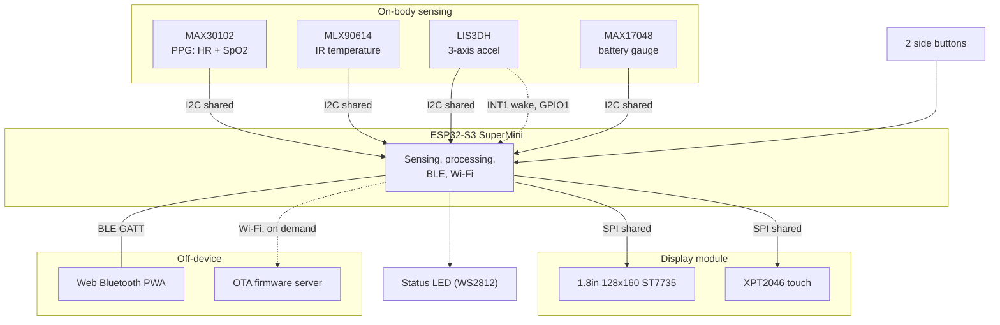
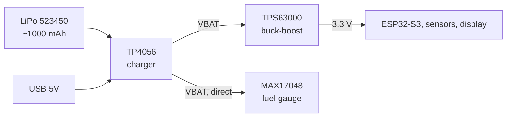
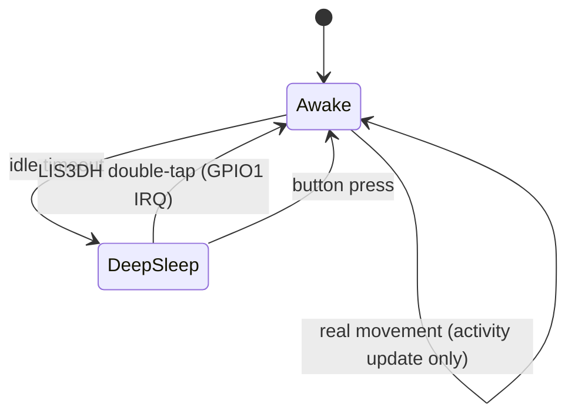
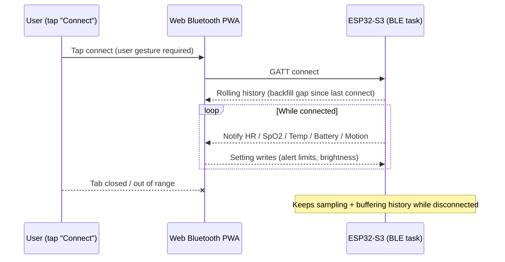
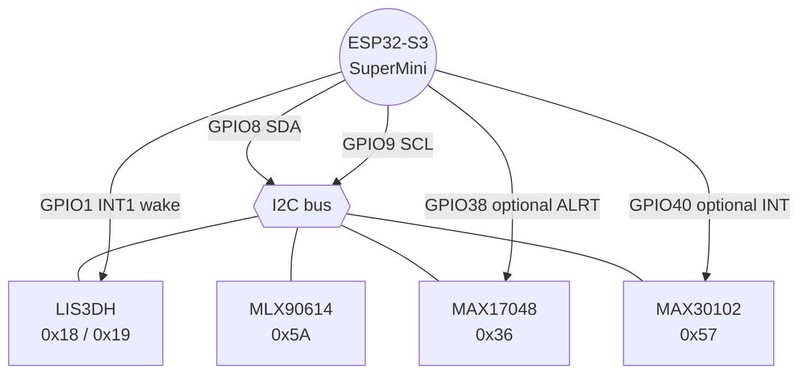
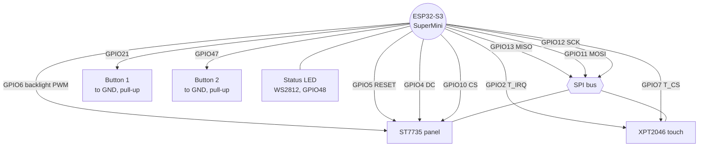
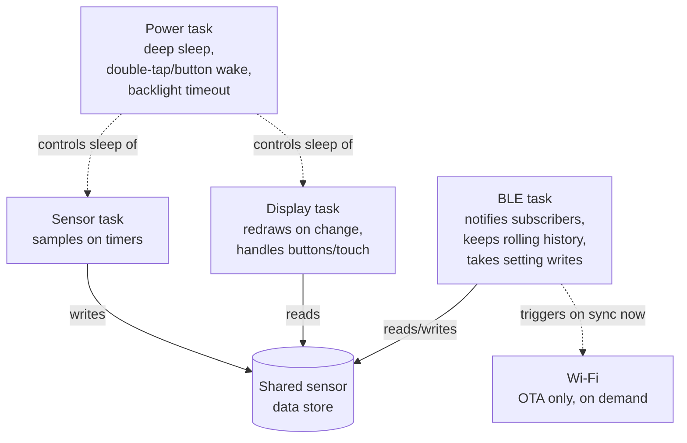

# BEME Upper-Arm Wearable — Firmware Build Brief

A health-and-motion band worn on the upper arm, built on the **ESP32-S3
SuperMini**. It senses on the body, shows live readings on a **128×160 1.8"
ST7735** panel with **XPT2046** touch, and syncs to an Android/desktop
**Web Bluetooth PWA** over BLE, with Wi-Fi reserved for firmware updates.

> **Status:** hardware and firmware architecture specified; implementation not yet started (see [§10 Repository status](#10-repository-status)).

---

## Table of contents

1. [What the device does](#1-what-the-device-does)
2. [System architecture](#2-system-architecture)
3. [Power architecture](#3-power-architecture)
4. [Sensing plan](#4-sensing-plan)
5. [On-screen readout and controls](#5-on-screen-readout-and-controls)
6. [Power design](#6-power-design)
7. [Communication](#7-communication)
8. [Wiring](#8-wiring)
9. [Firmware layout](#9-firmware-layout)
10. [Repository status](#10-repository-status)
11. [Bring-up checklist](#11-bring-up-checklist)

---

## 1. What the device does

- **Heart rate and SpO₂** — MAX30102 (PPG).
- **Skin-surface temperature** — MLX90614 (non-contact infrared).
- **Motion and activity** — LIS3DH (steps, activity state, double-tap wake, fall flag).
- **Battery charge** — MAX17048 fuel gauge.
- Live values on-screen, navigated with two side buttons (touch panel as a
  secondary control).
- Full-screen alert plus status LED when a reading crosses a set limit, mirrored
  to the phone as a notification.
- A short rolling history held in memory, sent to the phone on connect.

The upper arm is a harder spot for PPG than a fingertip or wrist, so the
accelerometer does double duty: activity tracking, and a movement reference the
firmware uses to reject noisy PPG windows.

---

## 2. System architecture



Power path — see [§3](#3-power-architecture) for the diagram.

---

## 3. Power architecture



- The MAX17048 reads the raw cell voltage off **VBAT**, upstream of the
  buck-boost, so its state-of-charge reading isn't affected by regulation.
- USB and battery both ultimately feed the 3.3 V rail — see the diode note in
  [§6](#6-power-design) for how they're kept from fighting each other.

---

## 4. Sensing plan

| Sensor   | Reads                          | Sample rate                   | On-device output                                           |
| -------- | ------------------------------ | ------------------------------ | ----------------------------------------------------------- |
| MAX30102 | Red + IR PPG                   | ~100 Hz in short bursts        | Heart rate (bpm), SpO₂ (%)                                  |
| MLX90614 | Object + ambient IR temp       | 0.5–1 Hz                       | Skin-surface temp (°C), with an offset for a body estimate  |
| LIS3DH   | X/Y/Z acceleration             | 25–100 Hz                      | Step count, activity state, tap, fall flag                  |
| MAX17048 | Cell voltage & state of charge | on demand / every few minutes  | Battery %, low-battery flag                                 |

Processing notes:

- **Heart rate / SpO₂** — collect a rolling window of PPG samples, filter, and
  run a peak/ratio calculation. Use the accelerometer to mark windows where the
  arm moved too much, and hold the last good value rather than showing a jumpy
  number.
- **Temperature** — apply a fixed offset to the MLX90614 reading and smooth
  across a few samples; treat it as a trend, not a clinical reading.
- **Activity** — use the LIS3DH FIFO and interrupt lines so the main chip stays
  asleep and wakes only on real movement or a double-tap.

---

## 5. On-screen readout and controls

- **Home screen** — heart rate and SpO₂ as large numbers, with temperature, step
  count, and a battery bar underneath.
- **Detail screens** — one signal at a time with a short scrolling trend line,
  reached with the buttons.
- **Alerts** — full-screen warning plus a blinking status LED, mirrored to the phone.
- **Settings** — brightness, alert limits, and a "sync now" action that briefly
  turns on Wi-Fi.

Two side buttons are the main control; the XPT2046 touch layer is available for
the odd on-screen tap.

**Wake on double-tap.** The screen and main chip deep-sleep after a short idle
period. The LIS3DH stays awake on its own hardware tap engine, watching for a
double-tap, and raises an interrupt on **GPIO1** to wake the chip and light the
screen. A button press wakes it too. In firmware, the Adafruit LIS3DH library
exposes this through `setClick(2, threshold)`; tune the threshold and tap timing
so a deliberate double-tap fires but ordinary arm movement does not.



---

## 6. Power design

- **Charging** — TP4056 charges the 523450 LiPo (~1000 mAh) over USB. Size the
  charge-current resistor for the cell (1C is a safe default).
- **Rail** — LiPo → TP4056 output (VBAT) → TPS63000 buck-boost → steady 3.3 V.
  Feed that 3.3 V straight to the ESP32-S3 SuperMini **3V3 pin** and to the
  sensors and display.
- **USB + battery together** — put a Schottky diode between the buck-boost
  output and the 3V3 pin (or unplug the battery rail while programming over USB),
  so the two sources don't fight on the 3V3 net.
- **Fuel gauge** — the MAX17048 reads the cell straight off VBAT.
- **Sleep** — deep sleep between sample bursts; the LIS3DH wakes the chip on a
  double-tap or real movement, with a button as a fall-back. Wi-Fi stays off
  unless a sync or update is requested.

---

## 7. Communication

**BLE**, modelled as GATT services:

| Service                   | UUID        | Carries                                            |
| -------------------------- | ----------- | --------------------------------------------------- |
| Heart Rate                | `0x180D`    | Live bpm                                           |
| Health Thermometer        | `0x1809`    | Temperature reading                                |
| Battery                   | `0x180F`    | Charge percentage                                  |
| Custom "Motion & Control" | vendor UUID | Steps, activity state, alert flags, settings write |

**Wi-Fi**, switched on only for OTA firmware updates.

**Companion app** — a Web Bluetooth PWA, served over HTTPS, using
`navigator.bluetooth` to pair and read/write the GATT characteristics above.
Every connection needs a fresh user tap (no silent reconnect), and the link
drops when the tab closes — the band's rolling history covers the gap by
re-sending recent readings on reconnect.



---

## 8. Wiring

All four sensors share **one I2C bus** (SDA, SCL). The display and touch
controller share **one SPI bus** (SCLK, MOSI, MISO) with separate chip-selects.

**I2C bus (sensors):**



**SPI bus (display/touch) and remaining GPIO:**



### 8.1 Display module pinout

**Display + power**

| Board pin | Meaning              | Connect to       |
| --------- | -------------------- | ---------------- |
| VCC       | Panel supply         | 3.3 V            |
| GND       | Ground               | GND              |
| CS        | Display chip select  | ESP32 GPIO       |
| RESET     | Display reset        | ESP32 GPIO       |
| A0        | Data/command (DC/RS) | ESP32 GPIO       |
| SDA       | SPI data in          | Shared MOSI      |
| SCK       | SPI clock            | Shared SCLK      |
| LED       | Backlight            | ESP32 GPIO (PWM) |

**Touch (XPT2046)**

| Board pin | Meaning            | Connect to         |
| --------- | ------------------- | ------------------- |
| T_CLK     | Touch SPI clock    | Shared SCLK        |
| T_CS      | Touch chip select  | ESP32 GPIO         |
| T_DIN     | Touch SPI data in  | Shared MOSI        |
| T_DO      | Touch SPI data out | Shared MISO        |
| T_IRQ     | Pen-down interrupt | ESP32 GPIO (input) |

### 8.2 Power rails

| Rail           | Source                         | Feeds                               |
| -------------- | ------------------------------- | ------------------------------------ |
| Cell 3.0–4.2 V | LiPo 523450 → TP4056 `B+`/`B−` | —                                    |
| VBAT           | TP4056 `OUT+`/`OUT−`           | Buck-boost input, MAX17048          |
| 3.3 V          | TPS63000 buck-boost from VBAT  | ESP32 3V3 pin, all sensors, display |

### 8.3 ESP32-S3 SuperMini pin map

| Function                      | Module pin(s) it serves | GPIO | Note                                          |
| ------------------------------ | ------------------------ | ---- | ----------------------------------------------- |
| SPI clock (shared)            | SCK, T_CLK              | 12   | Display + touch                               |
| SPI MOSI (shared)             | SDA, T_DIN              | 11   | Display + touch                               |
| SPI MISO (shared)             | T_DO                    | 13   | Touch data back                               |
| Display chip select           | CS                      | 10   |                                                |
| Display data/command          | A0                      | 4    |                                                |
| Display reset                 | RESET                   | 5    |                                                |
| Display backlight             | LED                     | 6    | PWM                                            |
| Touch chip select             | T_CS                    | 7    |                                                |
| Touch interrupt               | T_IRQ                   | 2    | Input                                          |
| LIS3DH INT1 (double-tap wake) | —                        | 1    | RTC-capable pin, required for deep-sleep wake |
| I2C data                      | sensor SDA              | 8    | Shared by all four sensors                    |
| I2C clock                     | sensor SCL              | 9    | Shared by all four sensors                    |
| Button 1                      | —                        | 21   | To GND, internal pull-up; also a wake source  |
| Button 2                      | —                        | 47   | To GND, internal pull-up                      |
| Status LED                    | on-board WS2812         | 48   |                                                |
| MAX30102 INT                  | —                        | 40   | Optional                                       |
| MAX17048 ALRT                 | —                        | 38   | Optional low-battery flag                     |

**Pins to keep clear:** GPIO 0, 45, 46 (boot strapping), GPIO 3 (strapping),
GPIO 19/20 (USB), GPIO 43/44 (serial debug). GPIO 26–32 are tied to flash/PSRAM
and are not brought out. The map above avoids all of these.

### 8.4 I2C addresses

| Device   | Address            |
| -------- | ------------------- |
| LIS3DH   | `0x18` (or `0x19`) |
| MLX90614 | `0x5A`             |
| MAX17048 | `0x36`             |
| MAX30102 | `0x57`             |

Add 4.7 kΩ pull-ups on SDA and SCL if the sensor boards don't already carry them.

---

## 9. Firmware layout

```
Firmware/
├── platformio.ini            # board = esp32-s3, framework = arduino
├── README.md                 # this file
└── src/
    ├── main.cpp              # setup, task creation, coordination
    ├── config.h              # pin map, I2C addresses, alert limits
    ├── sensors/
    │   ├── ppg_max30102.*    # HR + SpO2, with motion gating
    │   ├── temp_mlx90614.*   # temperature + offset
    │   ├── motion_lis3dh.*   # steps, activity, tap, fall, wake
    │   └── fuel_max17048.*   # battery %
    ├── display/
    │   ├── screen.*          # ST7735 via TFT_eSPI
    │   ├── touch_xpt2046.*   # touch read + calibration
    │   └── ui_screens.*      # home, detail, alert, settings
    ├── comms/
    │   ├── ble_gatt.*        # standard + custom services; rolling history buffer
    │   └── wifi_sync.*       # OTA firmware update, on demand
    └── power/
        └── power_mgr.*       # deep sleep, double-tap wake, backlight timeout
```

### Libraries

- **Display:** `TFT_eSPI`, ST7735 driver, with the SPI pins above; set the
  correct 128×160 tab/offset and colour order at bring-up.
- **Touch:** an `XPT2046` library, sharing the SPI bus with its own chip-select and calibration.
- **PPG:** the SparkFun MAX3010x library, or the MAXREFDES117 HR/SpO₂ routine.
- **Temperature:** an Adafruit or SparkFun MLX90614 library.
- **Motion:** an Adafruit or STMicro LIS3DH library, with FIFO, interrupts, and `setClick` enabled.
- **Battery:** a MAX17048 library.
- **Bluetooth:** `NimBLE-Arduino`.
- **Companion app:** plain `navigator.bluetooth` (Web Bluetooth) plus a light charting library.

### Task shape (FreeRTOS)



- A sensor task that samples on timers and pushes results to a shared store.
- A display task that redraws on change and handles the buttons and touch.
- A BLE task that notifies subscribers, keeps the rolling history, and takes setting writes.
- A power task that manages deep sleep, double-tap/button wake, and backlight timeout.
- Wi-Fi called only for an update, not in the hot loop.

---

## 10. Repository status

This repository currently holds only this build brief — no `platformio.ini`,
source, or drivers have been committed yet. The layout in [§9](#9-firmware-layout)
is the intended structure once implementation starts, not a description of
what exists on disk today.

---

## 11. Bring-up checklist

1. **ST7735 tab and offsets** — set in `TFT_eSPI` until the image sits square with correct colours.
2. **Display VCC** — confirm 3.3 V lights the backlight fully.
3. **Fuel-gauge I2C level** — check whether the MAX17048 module's I2C pull-ups reference VBAT or a regulated 3.3 V, and add a level shifter if needed before joining the shared bus.
4. **PSRAM** — print `ESP.getPsramSize()` to confirm what's fitted.
5. **Double-tap tuning** — set the LIS3DH tap threshold and timing so a deliberate double-tap wakes the screen but ordinary arm movement does not, and confirm the GPIO1 interrupt brings the chip out of deep sleep.
