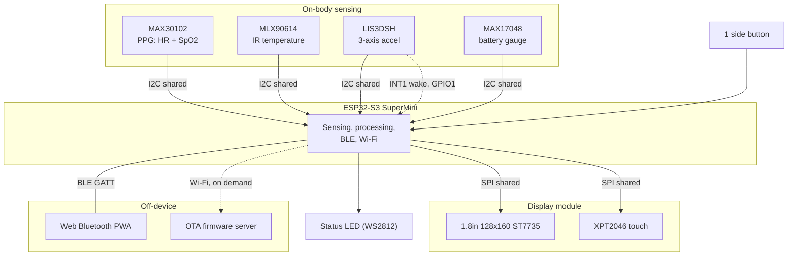
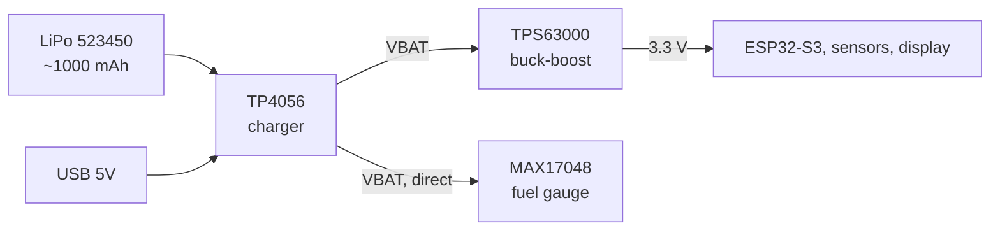
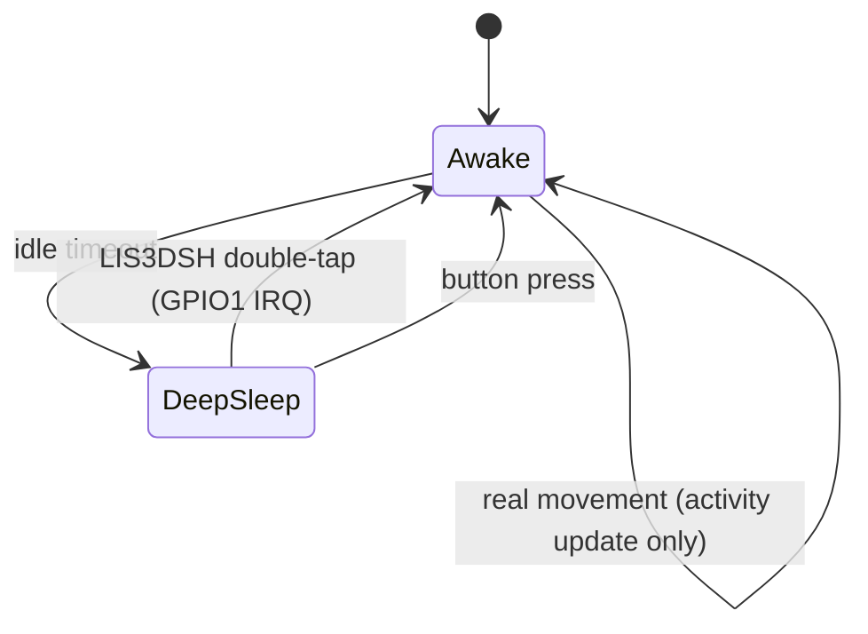
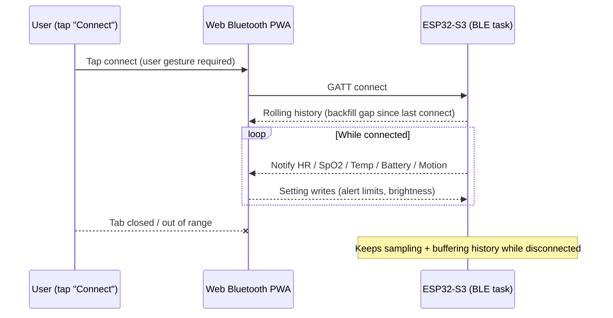
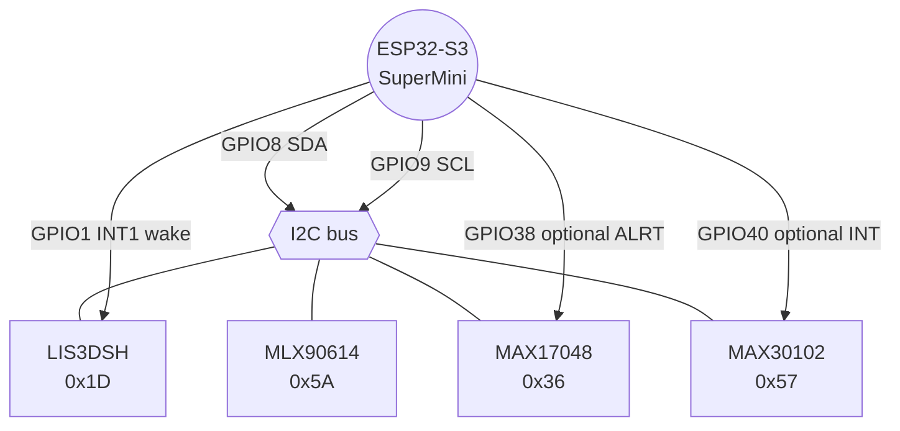
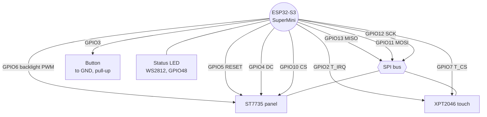
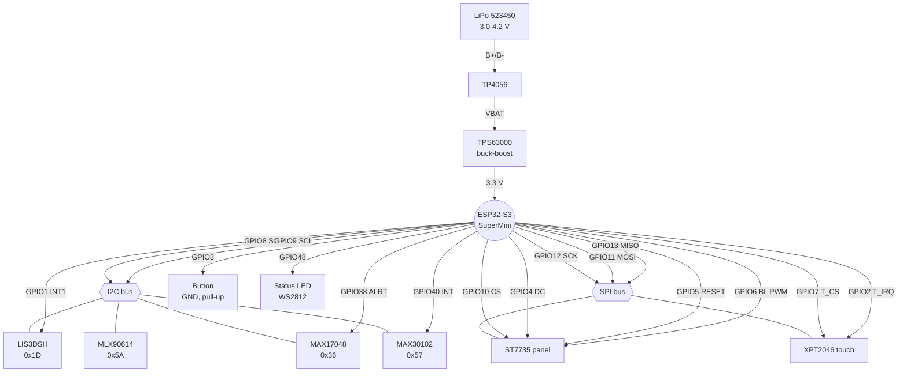
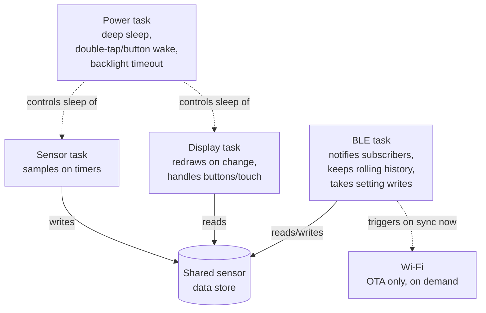

# BEME Upper-Arm Wearable — Firmware Build Brief

**Version:** 0.1.0

A health-and-motion band worn on the upper arm, built on the **ESP32-S3
SuperMini**. It senses on the body, shows live readings on a **128×160 1.8"
ST7735** panel with **XPT2046** touch, and syncs to an Android/desktop
**Web Bluetooth PWA** over BLE, with Wi-Fi reserved for firmware updates.

> **Status:** firmware builds and runs the full control flow described below (sensors, display, BLE, power, OTA scaffolding) against the real ESP32-S3 toolchain — but has not run on physical hardware yet (see [§10 Repository status](#10-repository-status)).

---

## Table of contents

1. [What the device does](#1-what-the-device-does)
2. [System architecture](#2-system-architecture)
3. [Power architecture](#3-power-architecture)
4. [Sensing plan](#4-sensing-plan)
5. [On-screen readout and controls](#5-on-screen-readout-and-controls)
6. [Power design](#6-power-design)
7. [Communication](#7-communication)
8. [Wiring](#8-wiring)
9. [Firmware layout](#9-firmware-layout)
10. [Repository status](#10-repository-status)
11. [Bring-up checklist](#11-bring-up-checklist)

---

## 1. What the device does

- **Heart rate and SpO₂** — MAX30102 (PPG).
- **Skin-surface temperature** — MLX90614 (non-contact infrared).
- **Motion and activity** — LIS3DSH (steps, activity state, double-tap wake, fall flag).
- **Battery charge** — MAX17048 fuel gauge.
- Live values on-screen, navigated with one physical button (full-screen
  cycling) plus a touch nav bar (direct jump + Detail-metric cycling).
- Full-screen alert plus status LED when a reading crosses a set limit, mirrored
  to the phone as a notification.
- A short rolling history held in memory, sent to the phone on connect.

The upper arm is a harder spot for PPG than a fingertip or wrist, so the
accelerometer does double duty: activity tracking, and a movement reference the
firmware uses to reject noisy PPG windows.

---

## 2. System architecture



Power path — see [§3](#3-power-architecture) for the diagram.

---

## 3. Power architecture



- The MAX17048 reads the raw cell voltage off **VBAT**, upstream of the
  buck-boost, so its state-of-charge reading isn't affected by regulation.
- USB and battery both ultimately feed the 3.3 V rail — see the diode note in
  [§6](#6-power-design) for how they're kept from fighting each other.

---

## 4. Sensing plan

| Sensor   | Reads                          | Sample rate                   | On-device output                                           |
| -------- | ------------------------------ | ------------------------------ | ----------------------------------------------------------- |
| MAX30102 | Red + IR PPG                   | ~100 Hz in short bursts        | Heart rate (bpm), SpO₂ (%)                                  |
| MLX90614 | Object + ambient IR temp       | 0.5–1 Hz                       | Skin-surface temp (°C), with an offset for a body estimate  |
| LIS3DSH  | X/Y/Z acceleration             | 25–100 Hz                      | Step count, activity state, tap, fall flag                  |
| MAX17048 | Cell voltage & state of charge | on demand / every few minutes  | Battery %, low-battery flag                                 |

Processing notes:

- **Heart rate / SpO₂** — collect a rolling window of PPG samples, filter, and
  run a peak/ratio calculation. Use the accelerometer to mark windows where the
  arm moved too much, and hold the last good value rather than showing a jumpy
  number.
- **Temperature** — apply a fixed offset to the MLX90614 reading and smooth
  across a few samples; treat it as a trend, not a clinical reading.
- **Activity** — use the LIS3DSH FIFO and interrupt lines so the main chip stays
  asleep and wakes only on real movement or a double-tap.

---

## 5. On-screen readout and controls

- **Home screen** — heart rate and SpO₂ as large numbers, with temperature, step
  count, and a battery bar underneath.
- **Detail screens** — one signal at a time with a short scrolling trend line,
  reached via the button or the touch nav bar.
- **Alerts** — full-screen warning plus a blinking status LED, mirrored to the phone.
  A tap or button press dismisses the warning screen back to normal navigation
  (found necessary at bring-up — without it, an active alert made every other
  screen unreachable for as long as the condition held); the status LED keeps
  reflecting the real condition regardless, and the warning screen re-interrupts
  after a cooldown if the condition is still active (see DEVELOPMENT.md).
- **Settings** — on-device: tap to cycle brightness (Low/Med/High), tap for a
  "sync now" action that briefly turns on Wi-Fi to check for a firmware
  update. Alert limits are phone-app-only by design (see DEVELOPMENT.md for
  why) — this screen just states that rather than pretending to offer it.

The single side button cycles Home → Detail → Settings → Home. A bottom
touch nav bar (Home/Detail/Set zones) jumps directly to any screen; tapping
the content area above the bar does something screen-specific — cycles the
shown metric on Detail, cycles brightness or triggers sync on Settings.
Touch is calibrated once, automatically, on first boot — see
[DEVELOPMENT.md](DEVELOPMENT.md) for how, and for the button-hold escape
hatch if the panel doesn't respond.

**Wake on double-tap.** The screen and main chip deep-sleep after a short idle
period. The LIS3DSH stays awake on its own hardware tap engine, watching for a
double-tap, and raises an interrupt on **GPIO1** to wake the chip and light the
screen. A button press wakes it too. **Not yet implemented in firmware** — the
sensor is driven by a direct-register I2C driver rather than a library (see
DEVELOPMENT.md), and double-tap detection via the chip's `CLICK_CFG` register
is deliberately deferred; see readme.md #11 for status. The wake source below
is registered but currently inert until that lands.



---

## 6. Power design

- **Charging** — TP4056 charges the 523450 LiPo (~1000 mAh) over USB. Size the
  charge-current resistor for the cell (1C is a safe default).
- **Rail** — LiPo → TP4056 output (VBAT) → TPS63000 buck-boost → steady 3.3 V.
  Feed that 3.3 V straight to the ESP32-S3 SuperMini **3V3 pin** and to the
  sensors and display.
- **USB + battery together** — put a Schottky diode between the buck-boost
  output and the 3V3 pin (or unplug the battery rail while programming over USB),
  so the two sources don't fight on the 3V3 net.
- **Fuel gauge** — the MAX17048 reads the cell straight off VBAT.
- **Sleep** — deep sleep between sample bursts; the LIS3DSH wakes the chip on a
  double-tap or real movement, with a button as a fall-back. Wi-Fi stays off
  unless a sync or update is requested.

---

## 7. Communication

**BLE**, modelled as GATT services:

| Service                   | UUID        | Carries                                                    |
| -------------------------- | ----------- | ------------------------------------------------------------ |
| Heart Rate                | `0x180D`    | Live bpm                                                   |
| Health Thermometer        | `0x1809`    | Temperature reading                                        |
| Battery                   | `0x180F`    | Charge percentage                                          |
| Custom "Motion & Control" | vendor UUID | SpO2, steps, activity state, alert flags, settings write   |

SpO2 has no dedicated BLE SIG characteristic wired up (the standard Pulse
Oximeter Service exists but its wire format is heavier than this project
needs), so it rides in the custom service as a plain percentage — see
[DEVELOPMENT.md](DEVELOPMENT.md#ble-uuids) for the exact UUID and format.

The settings-write characteristic accepts device-name, Wi-Fi-credential,
request-history, and start-OTA writes from the companion app — see
[DEVELOPMENT.md](DEVELOPMENT.md#settings-wire-protocol) for the exact byte
format, and note there is no authentication on this write at the BLE layer
itself (the app's admin-password gate is client-side only). History is
sent only in response to an explicit request, not automatically on
connect — an earlier version auto-pushed it and lost the notifications to
a timing race with the client's own GATT subscription.

**Wi-Fi**, switched on only for OTA firmware updates.

**Companion app** — a Web Bluetooth PWA, served over HTTPS, using
`navigator.bluetooth` to pair and read/write the GATT characteristics above.
Every connection needs a fresh user tap (no silent reconnect), and the link
drops when the tab closes — the band's rolling history covers the gap by
re-sending recent readings on reconnect. Lives in [companion-app/](companion-app/)
— see its own [README](companion-app/README.md) and
[DEVELOPMENT.md](companion-app/DEVELOPMENT.md) for how to run it and its
conventions.



---

## 8. Wiring

All four sensors share **one I2C bus** (SDA, SCL). The display and touch
controller share **one SPI bus** (SCLK, MOSI, MISO) with separate chip-selects.

**I2C bus (sensors):**



**SPI bus (display/touch) and remaining GPIO:**



**Full pin map, single view (power + both buses + GPIO):**



A schematic-style version of the same connections, editable in
[diagrams.net](https://app.diagrams.net) (drawio), lives at
[`pin-map.drawio`](pin-map.drawio).

### 8.1 Display module pinout

**Display + power**

| Board pin | Meaning              | Connect to       |
| --------- | -------------------- | ---------------- |
| VCC       | Panel supply         | 3.3 V            |
| GND       | Ground               | GND              |
| CS        | Display chip select  | ESP32 GPIO       |
| RESET     | Display reset        | ESP32 GPIO       |
| A0        | Data/command (DC/RS) | ESP32 GPIO       |
| SDA       | SPI data in          | Shared MOSI      |
| SCK       | SPI clock            | Shared SCLK      |
| LED       | Backlight            | ESP32 GPIO (PWM) |

**Touch (XPT2046)**

| Board pin | Meaning            | Connect to         |
| --------- | ------------------- | ------------------- |
| T_CLK     | Touch SPI clock    | Shared SCLK        |
| T_CS      | Touch chip select  | ESP32 GPIO         |
| T_DIN     | Touch SPI data in  | Shared MOSI        |
| T_DO      | Touch SPI data out | Shared MISO        |
| T_IRQ     | Pen-down interrupt | ESP32 GPIO (input) |

### 8.2 Power rails

| Rail           | Source                         | Feeds                               |
| -------------- | ------------------------------- | ------------------------------------ |
| Cell 3.0–4.2 V | LiPo 523450 → TP4056 `B+`/`B−` | —                                    |
| VBAT           | TP4056 `OUT+`/`OUT−`           | Buck-boost input, MAX17048          |
| 3.3 V          | TPS63000 buck-boost from VBAT  | ESP32 3V3 pin, all sensors, display |

### 8.3 ESP32-S3 SuperMini pin map

| Function                      | Module pin(s) it serves | GPIO | Note                                          |
| ------------------------------ | ------------------------ | ---- | ----------------------------------------------- |
| SPI clock (shared)            | SCK, T_CLK              | 12   | Display + touch                               |
| SPI MOSI (shared)             | SDA, T_DIN              | 11   | Display + touch                               |
| SPI MISO (shared)             | T_DO                    | 13   | Touch data back                               |
| Display chip select           | CS                      | 10   |                                                |
| Display data/command          | A0                      | 4    |                                                |
| Display reset                 | RESET                   | 5    |                                                |
| Display backlight             | LED                     | 6    | PWM                                            |
| Touch chip select             | T_CS                    | 7    |                                                |
| Touch interrupt               | T_IRQ                   | 2    | Input                                          |
| LIS3DSH INT1 (double-tap wake) | —                       | 1    | RTC-capable pin, required for deep-sleep wake; currently inert — see #10/#11 |
| I2C data                      | sensor SDA              | 8    | Shared by all four sensors                    |
| I2C clock                     | sensor SCL              | 9    | Shared by all four sensors                    |
| Button                         | —                        | 3    | To GND, internal pull-up; also a wake source; JTAG-select strap — don't hold at power-on/reset |
| Status LED                    | on-board WS2812         | 48   |                                                |
| MAX30102 INT                  | —                        | 40   | Optional; not yet wired to firmware logic; also shares JTAG MTDO — revisit before use |
| MAX17048 ALRT                 | —                        | 38   | Optional low-battery flag; not yet wired to firmware logic |

**Physical access, not just electrical:** the ESP32-S3 SuperMini's core
header only covers **GPIO1–13**, plus GPIO15–17 confirmed separately
accessible. GPIO0 isn't exposed at all — it's wired internally to the
board's own onboard BOOT button, not just unbroken-out. Everything else used
above and not in that set — GPIO38, 40, 48 — sits on bottom-side pads with
no header access, needing a hand-soldered wire (a pogo-pin fixture would
help for repeated testing but isn't required for a permanent connection).
GPIO3 is what's left of GPIO1–13 once the display/touch/I2C/wake-sensor
wiring below claims the rest, which is why the sole button sits there
instead of needing the pad-soldering workaround. GPIO15 is now free (the
second button was dropped in favor of eventually letting touch cover that
navigation, readme.md #5) — reserved for whatever needs a header-accessible
pin next, rather than sitting unused for no reason.

**Pins to keep clear:** GPIO 0, 45, 46 (boot strapping), GPIO 19/20 (USB),
GPIO 43/44 (serial debug). GPIO 26–32 are tied to flash/PSRAM and are not
brought out. GPIO3 is also a boot-time strapping pin (JTAG interface select)
but is deliberately used above for Button 1 — see the note in the table.

### 8.4 I2C addresses

| Device   | Address            |
| -------- | ------------------- |
| LIS3DSH  | `0x1D` (hardware-confirmed — see DEVELOPMENT.md, not the LIS3DH originally speced here) |
| MLX90614 | `0x5A`             |
| MAX17048 | `0x36`             |
| MAX30102 | `0x57`             |

Add 4.7 kΩ pull-ups on SDA and SCL if the sensor boards don't already carry them.

---

## 9. Firmware layout

Coding conventions and a log of what's been scaffolded so far live in
[DEVELOPMENT.md](DEVELOPMENT.md) — read that before adding a new module so
naming, task shape, and bus ownership stay consistent.

```
Firmware/
├── platformio.ini            # board = esp32-s3-devkitc-1, framework = arduino
├── readme.md                 # this file
├── DEVELOPMENT.md            # conventions + scaffolding log
└── src/
    ├── main.cpp              # setup, task creation, coordination
    ├── config.h              # pin map, I2C addresses, alert limits, task tuning
    ├── sensor_data.*         # mutex-guarded shared sensor snapshot
    ├── sensors/
    │   ├── ppg_max30102.*    # HR + SpO2, with motion gating
    │   ├── temp_mlx90614.*   # temperature + offset
    │   ├── motion_lis3dh.*   # steps, activity, tap, fall, wake
    │   └── fuel_max17048.*   # battery %
    ├── display/
    │   ├── screen.*          # ST7735 via TFT_eSPI
    │   ├── touch_xpt2046.*   # touch read + calibration
    │   ├── ui_screens.*      # home, detail, alert, settings
    │   └── status_led.*      # on-board WS2812 alert blink
    ├── comms/
    │   ├── ble_gatt.*        # standard + custom services; rolling history buffer
    │   └── wifi_sync.*       # OTA firmware update, on demand
    └── power/
        └── power_mgr.*       # deep sleep, double-tap wake, backlight timeout
```

> **Status:** builds clean with real driver logic throughout (see
> [§10](#10-repository-status)) — not run on physical hardware yet.

### Libraries

- **Display:** `TFT_eSPI`, ST7735 driver, with the SPI pins above; set the
  correct 128×160 tab/offset and colour order at bring-up.
- **Touch:** an `XPT2046` library, sharing the SPI bus with its own chip-select and calibration.
- **PPG:** the SparkFun MAX3010x library, or the MAXREFDES117 HR/SpO₂ routine.
- **Temperature:** an Adafruit or SparkFun MLX90614 library.
- **Motion:** the physical sensor turned out to be an LIS3DSH, not the LIS3DH
  originally speced here — no maintained Arduino library exists for it worth
  depending on, so it's driven directly over I2C (`src/sensors/motion_lis3dsh.cpp`);
  see DEVELOPMENT.md. Click/double-click detection (`CLICK_CFG` register) is
  deferred, not yet wired up.
- **Battery:** a MAX17048 library.
- **Bluetooth:** `NimBLE-Arduino`.
- **Companion app:** plain `navigator.bluetooth` (Web Bluetooth) plus a light charting library.

### Task shape (FreeRTOS)



- A sensor task that samples on timers and pushes results to a shared store.
- A display task that redraws on change and handles the buttons and touch.
- A BLE task that notifies subscribers, keeps the rolling history, and takes setting writes.
- A power task that manages deep sleep, double-tap/button wake, and backlight timeout.
- Wi-Fi called only for an update, not in the hot loop.

---

## 10. Repository status

The `platformio.ini` and `src/` tree in [§9](#9-firmware-layout) build clean
against the real ESP32-S3 toolchain (PlatformIO), with real driver logic —
not stubs — for every subsystem in this brief:

- **Sensors** — LIS3DSH motion (steps, activity, fall flag — double-tap wake
  deferred, see #5/#11), MLX90614 temperature (smoothed), MAX17048 battery,
  and MAX30102 HR/SpO2 (motion-gated, ratio-of-ratios algorithm) are all
  wired to real driver logic. PPG, Temp, and Fuel gauge confirmed
  initializing on real hardware; Motion's new direct-register driver not
  yet reflashed/re-verified as of this line — see #11 item 10.
- **Display** — ST7735 via TFT_eSPI, XPT2046 touch (calibrated on first
  boot, driving the nav bar and Detail-metric cycling), all four screens
  (Home/Detail/Alert/Settings) drawing real content, and the WS2812 status
  LED.
- **Power** — idle-timeout deep sleep with double-tap/button EXT1 wake, and
  a separate, longer timeout while a BLE client is connected so the band
  doesn't drop an active connection out from under itself.
- **BLE** — a real NimBLE GATT server: standard Heart Rate/Health
  Thermometer/Battery services plus the custom "Motion & Control" service,
  with a rolling history buffer sent on explicit client request (not
  auto-pushed — see [DEVELOPMENT.md](DEVELOPMENT.md#settings-wire-protocol)
  for why that changed), and a settings write path (device name, Wi-Fi
  credentials) persisted in NVS so it survives deep sleep.
- **Wi-Fi/OTA** — a real connect → update → disconnect flow. Credentials
  come from `SettingsStore` (app-configurable) falling back to
  `credentials.h` placeholders (no real network/server exists yet for this
  project); the OTA server URL itself is still compile-time only.

A companion Web Bluetooth PWA also exists — see
[companion-app/](companion-app/) — with a working connect flow, live
dashboard, and a Settings section (device rename, Wi-Fi credentials and an
OTA trigger behind a client-side admin-password gate, dark/light theme).

Two rounds of end-to-end logic review (tracing task/protocol timing, not
just compiling) found seven real runtime bugs; all seven are now fixed — see
[DEVELOPMENT.md](DEVELOPMENT.md) for the detail on each:

- The alert status LED was structured so it could never actually blink
- The BLE history backfill was lost to a subscription-timing race almost every time
- The idle timer had no concept of an active BLE connection, so the band could deep-sleep mid-session
- `BleGatt`'s history/connection-count/OTA-request state was touched from two different FreeRTOS tasks with no synchronization — now guarded by a mutex
- No sensor's `begin()` return value was ever checked, so a miswired sensor failed completely silently — `setup()` now shows an on-device error screen if anything fails to initialize
- OTA had no trigger anywhere in the firmware or the companion app — both sides now have one (settings command `0x04`, a dedicated `otaTask`, and a "Start update" button)
- The companion app's local history array was never cleared on reconnect and grew unboundedly

What's still open: step-counting (rising-edge magnitude counter) and
fall-detection (free-fall-then-impact) are real, simple heuristics now
rather than unimplemented stubs, but their thresholds are guesses, not
tuned against real data; the on-device Settings screen now has
brightness cycling and a "sync now" trigger wired to touch, but alert
limits are phone-app-only by design, not yet-to-be-built; the BLE settings
write has no authentication at the transport level (see
[DEVELOPMENT.md](DEVELOPMENT.md#settings-wire-protocol) — the companion
app's admin password is a client-side deterrent only); and — most
importantly — **none of this has run on physical hardware**. See
[DEVELOPMENT.md](DEVELOPMENT.md) for the full implementation log and the
conventions behind these decisions, and [§11](#11-bring-up-checklist) for
what's next once real hardware is in hand.

---

## 11. Bring-up checklist

1. **ST7735 tab and offsets** — set in `TFT_eSPI` until the image sits square with correct colours.
2. **Display VCC** — confirm 3.3 V lights the backlight fully.
3. **Fuel-gauge I2C level** — check whether the MAX17048 module's I2C pull-ups reference VBAT or a regulated 3.3 V, and add a level shifter if needed before joining the shared bus.
4. **PSRAM** — print `ESP.getPsramSize()` to confirm what's fitted.
5. **Double-tap wake — not yet implemented, not just untuned.** The physical Motion sensor turned out to be an LIS3DSH, not the LIS3DH originally speced (see item 10 below); its click/double-click detection lives in the `CLICK_CFG`/`CLICK_SRC`/`CLICK_THS` registers, which the current direct-register driver (`src/sensors/motion_lis3dsh.cpp`) doesn't touch yet. `PIN_LIS3DSH_INT1`'s EXT1 wake registration is in place and harmless, but inert until this lands. Deferred deliberately (see DEVELOPMENT.md), not forgotten.
6. **BLE advertising restart mid-connection** — fixed: `BleGatt::applyDeviceName()` no longer restarts advertising synchronously inside the GATT write callback that requests a rename (that would race NimBLE's automatic ATT Write Response on the same connection). It's queued and applied from `bleTask` instead, a separate FreeRTOS task guaranteed to run only after the callback has returned. Still worth confirming on real hardware that the rename is actually visible to a scanning phone within a tick or two.
7. **NimBLE host task stack headroom** — reduced, not eliminated: `sendHistoryBacklog()`'s 600-byte snapshot moved from a stack-local array to a class member, removing the single largest known contributor to that call's stack usage on NimBLE's own host task. This doesn't prove the rest of that call chain (NimBLE's own internal processing, `String`/`Serial.printf` usage elsewhere in the same path) fits comfortably — still worth checking `uxTaskGetStackHighWaterMark()` for that task after triggering a history request on real hardware.
8. **Flash size — fixed, confirmed on first real flash.** The `esp32-s3-devkitc-1` board definition's 8MB-flash default (`upload.flash_size`/`default_8MB.csv`) doesn't match this project's actual 4MB SuperMini units — left unoverridden, the built binary's embedded flash-size header disagreed with the real chip at boot, which is fatal (`spi_flash: Detected size(4096k) smaller than the size in the binary image header(8192k). Probe failed.` / `assert failed: do_core_init`), not a soft warning. `platformio.ini` now pins `board_upload.flash_size = 4MB` and `board_build.partitions = default.csv` (see DEVELOPMENT.md's dated entry). Flash headroom is now genuinely tighter than earlier builds reported — 80.4% used (1,053,789 / 1,310,720 bytes) against the real 1.25MB OTA app slot, not the phantom 3.19MB one every prior build number in this doc was silently measured against.
9. **TFT_eSPI/ESP32-S3 SPI register crash — fixed, confirmed on first real flash.** `TFT_eSPI::init()` writes directly to an SPI peripheral register computed from a macro (`SPI_PORT`) that TFT_eSPI sets from the Arduino core's own `FSPI` constant — which is `0` on this installed core for S3-family chips, not the raw peripheral index (`2`) the register math actually needs. That mismatch faulted the very first display write (`StoreProhibited` at address `0x10`, traced to the exact instruction via `addr2line`/`objdump` against the built ELF, not guessed). Fixed with `-D USE_FSPI_PORT=1` in `platformio.ini`, TFT_eSPI's own documented escape hatch for this. See DEVELOPMENT.md's dated entry for the full register-address trace.
10. **I2C bus — one real bug and one chip misidentification, both diagnosed via a real hardware scan; fixes not yet reflashed.** `PpgMax30102::begin()` was silently reconfiguring the *shared* I2C bus to 400kHz (`I2C_SPEED_FAST`) for every sensor after it — the MLX90614 doesn't reliably tolerate above its 100kHz spec, so it failed to initialize even though present and responding (confirmed via a boot-time bus scan: found at the right address before PPG ran, failed the identical check after). Fixed by using `I2C_SPEED_STANDARD` instead — also the SparkFun library's own default. Separately, the same scan found the Motion sensor at `0x1D`, not the LIS3DH's `0x18`/`0x19` — turned out to be a genuinely different chip, the LIS3DSH, confirmed by its `WHO_AM_I` register (`0x3F`, not LIS3DH's `0x33`). `Adafruit_LIS3DH` was replaced with a direct-register I2C driver (`src/sensors/motion_lis3dsh.cpp`) written against STMicroelectronics' own `stm32-lis3dsh` reference source; double-tap wake deliberately deferred (item 5 above). Not yet reflashed/re-verified on hardware as of this entry — next step. The Fuel gauge (`0x36`) not appearing in the scan was confirmed to be simply not connected yet, not a bug.
